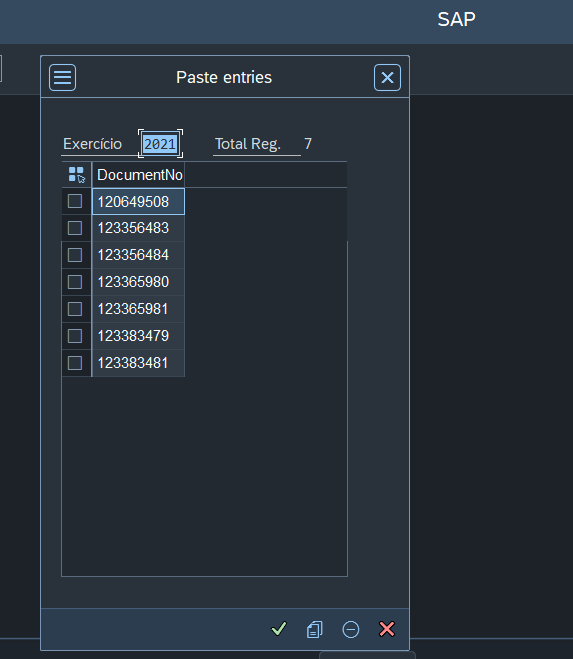

# Exibe pop-up com função de clipboard para colar registros
Função que exibe pop-up para o usuário poder colar vários registros, função aceita qualquer valor que for passado na estrutura.
 
 
 
[Link programa de exemplo utilizando a função](src/zpopup_clipboard_example.prog.abap)
 
 
 ## Opções da função:
 - Retorna todas as linhas copiadas do usuário
 - Exibe o total de registros copiados
 - Permite informar qualquer título
 - Permite informar o tipo de dados que irá copiar
 - Permite remover itens direto na tela
 
 ### Parâmetros de importação da função:
| Parâmetro | Descrição |
| --- | --- |
| I_DIMENSION | Informar as dimensções do pop-up(Opcional) |
| I_STRUCTURE | Informar a estrutura do campo que será colado |
| I_TITLEBAR | Informar o título do Pop-up |

### Parâmetros de retorno da função:
| Parâmetro | Descrição |
| --- | --- |
|E_TABLE | Retorna linhas copiadas pelo usuário |

